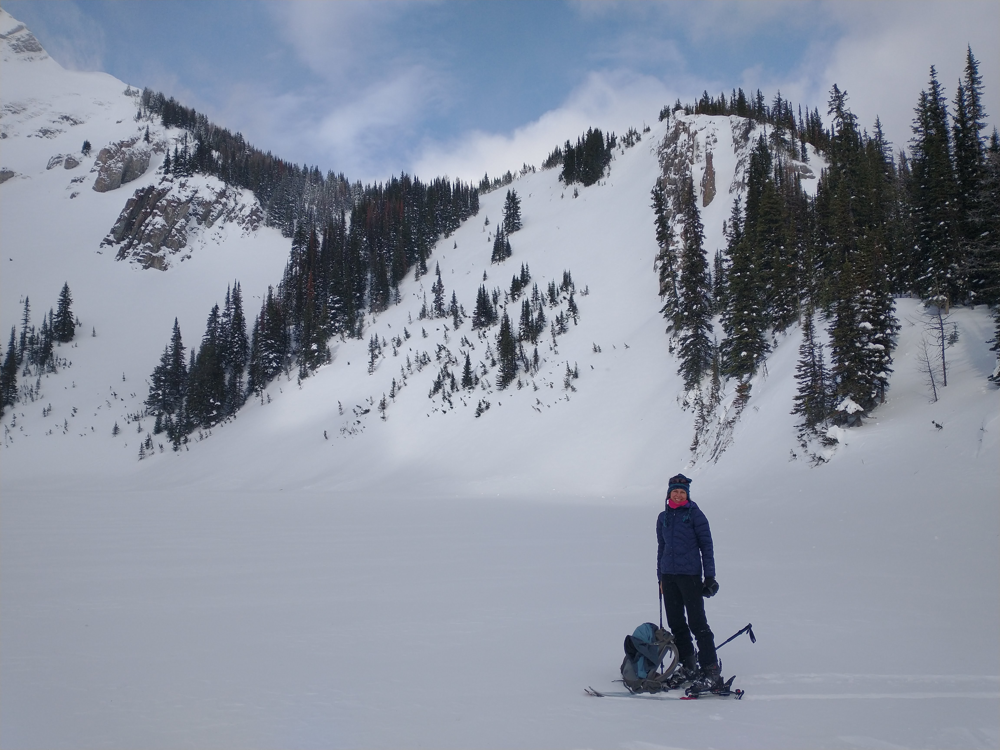
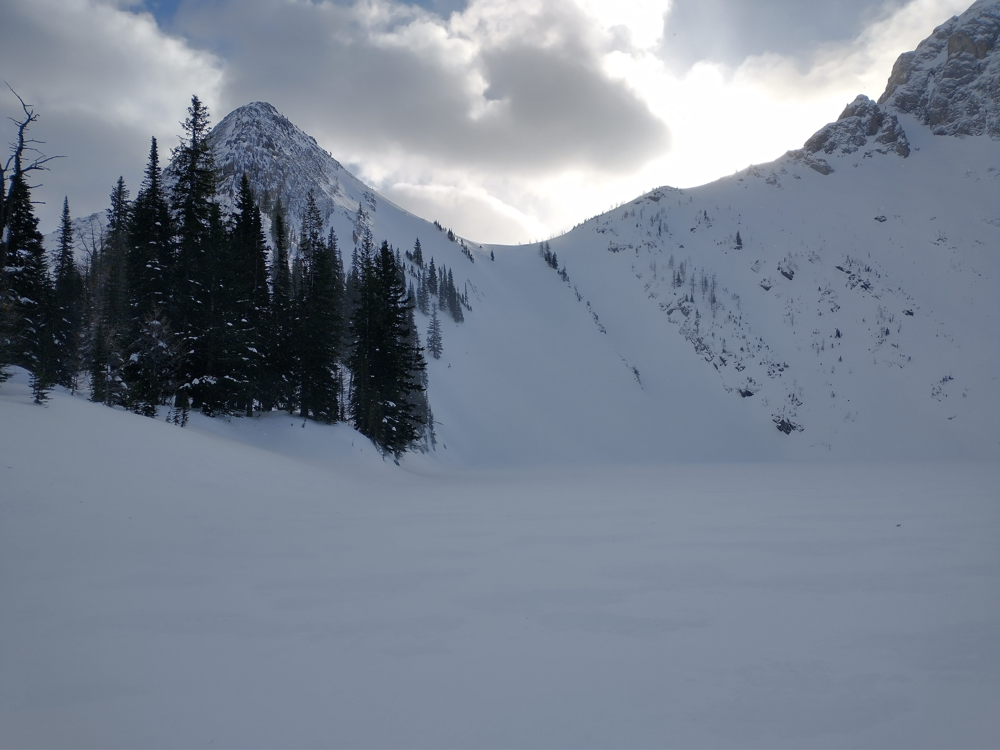
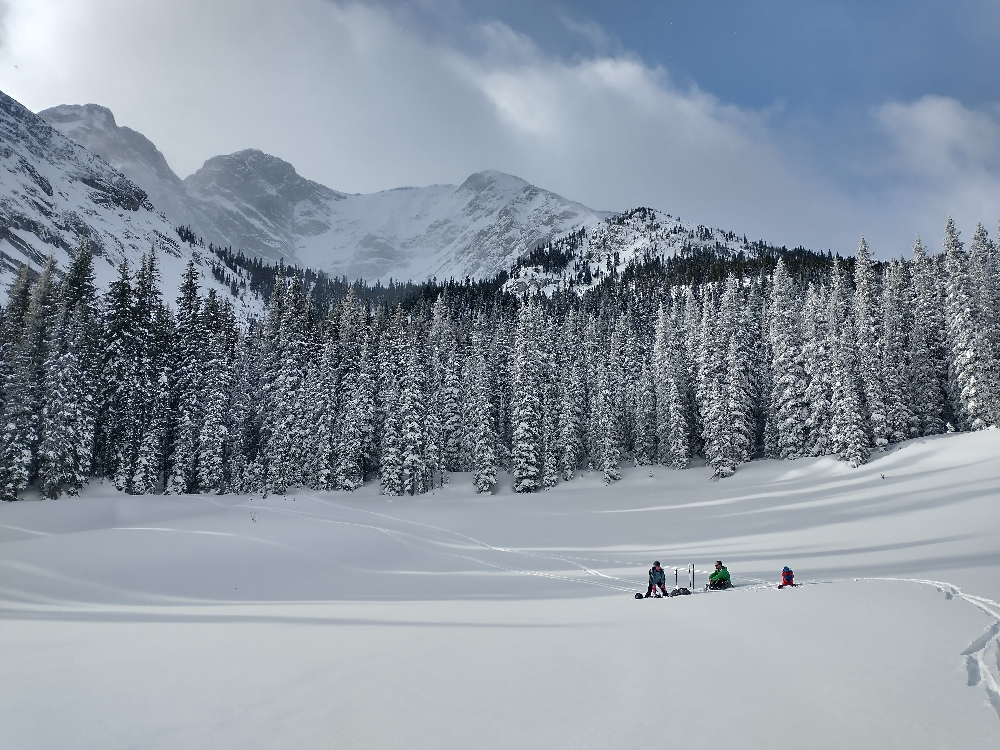

+++
title = "Frozen Lake"
date = "2023-06-01"
draft = False
+++

Frozen Lake offers short tree skiing pitches and a couple of open chutes, with steeper terrain ranging from 35 to 40 degrees leading to a flat lake (terrain Trap!). The approach is longer, but the groomed trail provides a fast exit. Remember to be courteous to cross-country skiers by leaving your dog at home and avoiding busy cross-country trail times. Ski single file and, when stopping, do so off the groomer. Do to the longer approach the powder is often well preserved.

## Approach

Park at the Elk Lake Pass parking lot. From there, follow the groomed cross country Elk Pass trail until you reach the turn off for Blueberry Hill. You have two options from here. The first option is to continue along the Blueberry Pass trail for approximately one kilometer before making your way up to Fox Ridge. The skiing is fairly steep through thick forest but you may avoid heading North or South. Alternatively, you can choose to stay on the flat terrain leading towards Fox Lake and then ascend via the summer trail located on the Alberta-British Columbia border.

## East aspect Below Frozen Lake to Fox Lake

The open avalanche slope lookers left often catch down drafting west winds but offer 200m of good skiing. Lookers right, there is 125m runs of excellent Larch trees for skiing. However, beyond that point, the forest becomes too dense and tight for enjoyable skiing.

## Fox Ridge North avalanche paths

Arguably the best skiing in the area. There is 250m ski lines consisting of avalanche chutes which increase in risk from lookers left to right. The creek can be followed out to the blueberry hill trail (the rolling flats might require skins). The two far lookers right chutes have cross-loaded start zones and I haven't skies them yet.

## NE Trees of Fox Ridge

There is 200m of good skiing from the top of the ridge but the last 150m of vertical back to the Blueberry hill trail is quite tight.

## Fox Ridge South slopes to Frozen Lake

The short but steep open slopes lead to the lake; however, it's important to note that the terrain poses a risk as it becomes a potential trap due to the sudden change in slope onto the lake. I have skied the Mature trees down to the lake, but the trees have some flagging indicated that avalanches occasionally go through the trees.

## North Slopes of Taiga Viewpoint.

Short steep slopes lead to a flat lake (terrain trap!)

## South Avalanche Paths off Taiga Viewpoint

On the exploration todo list, either attempt it from the Elk Lakes Cabin or long day from the road.

## Exit

From any of the runs, take the Blueberry Hill trail back down and return via the Elk Pass trail. Descending halfway to the Blueberry Hill lookout towards the Elk Pass trail is not recommended due to tight terrain and insufficient steepness.

